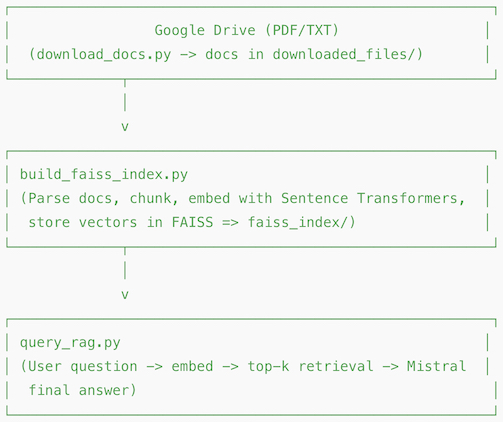

# Raspberry Pi 5 AI (Hybrid RAG) – Project Journal 🚀

This `README.md` documents a **Retrieval-Augmented Generation (RAG)** pipeline built on a **Raspberry Pi 5 16GB**. 

The project uses:

-   **Sentence Transformers** (specifically `all-MiniLM-L6-v2`) for efficient text embeddings.
-   **Mistral 7B (Q4_K_M)** for local text generation.
-   **FAISS** for fast vector similarity search.
-   **Google Drive** as a document source (PDFs and TXT files).
-   And, when necessary, the "**fresh Finnish air**" method for rapid CPU cooling! (While waiting for PoE hat with cooling.
-   Also installed a **BM2L-AIS-H8L** Hailo AI hat, however only minimal testing so far...

This file serves as a project journal, tracking progress, design decisions, and future plans.

---

## Table of Contents

1.  [Project Overview](#project-overview)
2.  [Changelog & Versions](#changelog--versions)
3.  [Raspberry Pi 5 Photo & Pipeline Diagram](#rpi5-diagram)
4.  [Hybrid RAG Workflow](#rag-workflow)
5.  [Setup & Requirements](#setup)
6.  [Chunking & Tuning](#chunking)
7.  [Testing & Benchmarking](#testing)
8.  [Future / "Pro" Suggestions](#pro-suggestions)
9.  [Credits & Contact](#credits)
10. [Example Usage](#usage)
11. [Next Steps](#next-steps)

---

## 1. Project Overview

The initial goal was to use Mistral 7B for both embedding and generation. However, older versions of `llama-cpp-python` only provided a single float per token as output, not the full 4096-dimensional embedding vector.  Therefore, we adopted a *hybrid* approach:

-   **Sentence Transformers:**  Provides CPU-efficient text embeddings (384 dimensions).
-   **Mistral 7B (Q4_K_M):**  Handles the final text generation (achieving 3-4 tokens/second on the Pi 5).
-   **FAISS:** Enables fast vector indexing and similarity search.
-   **Google Drive:**  Serves as the source for documents (PDFs and TXT files), accessed via a service account.

The pipeline chunks documents, creates embeddings, stores them in FAISS, and then, at query time, embeds the user's question, retrieves the most relevant document chunks from FAISS, and feeds those chunks along with the question to Mistral 7B to generate a final answer.

---

## 2. Changelog & Versions

### v1.0 (Initial Hybrid RAG) - 2024-02-29

-   Implemented the hybrid approach using Sentence Transformers for embeddings and Mistral 7B for generation.
-   Created `build_faiss_index.py` and `query_rag.py`.

### v1.1 (Chunking & Tuning) - 2024-03-03

-   Experimented with different chunk sizes (300-800 characters) and overlap (~50%).
-   Documented best practices for chunking.

### v1.2 (Testing & Benchmarking) - 2024-03-07

-   Added timing code to measure index building and query latency.
-   Observed CPU and memory usage on the Raspberry Pi 5.

---

## 3. Raspberry Pi 5 Photo & Pipeline Diagram

### 3.1 Pi 5 Photo

### 3.2 Pipeline Diagram

---

## 4. Hybrid RAG Workflow

1.  **Download:** The `download_docs.py` script retrieves documents (PDFs and TXT files) from a specified Google Drive folder using a service account.  Downloaded files are stored in the `downloaded_files/` directory.
2.  **Index:** The `build_faiss_index.py` script performs the following:
    *   Parses the downloaded documents.
    *   Chunks the text content into smaller pieces.
    *   Creates embeddings for each chunk using Sentence Transformers.
    *   Stores the embeddings and chunk IDs in a FAISS index (saved to the `faiss_index/` directory).
3.  **Query:** The `query_rag.py` script handles user queries:
    *   Embeds the user's question using Sentence Transformers.
    *   Searches the FAISS index for the most similar document chunks.
    *   Constructs a prompt for Mistral 7B, including the retrieved chunks and the original question.
    *   Generates the final answer using Mistral 7B.

---

## 5. Setup & Requirements

### 5.1 Pi 5 Environment

-   Raspberry Pi 5 (8GB RAM recommended)
-   Debian Bookworm (64-bit)
-   Python 3.11+

\`\`\`bash
sudo apt-get update
sudo apt-get install python3.11 python3.11-venv
python3.11 -m venv ~/ai_env
source ~/ai_env/bin/activate
\`\`\`

> **Thermal Note:** The Raspberry Pi 5 CPU can reach temperatures of 80-90°C under sustained load.  Using a heatsink and fan, or a PoE hat with a fan, is highly recommended to prevent thermal throttling.

### 5.2 Dependencies & Models

Create a `requirements.txt` file with the following contents:

\`\`\`
sentence-transformers
faiss-cpu
PyPDF2
google-api-python-client
google-auth-httplib2
google-auth-oauthlib
llama-cpp-python
\`\`\`

Install the dependencies:

\`\`\`bash
pip install -r requirements.txt
\`\`\`

**`llama-cpp-python` Installation:** You may need to specify build flags when installing `llama-cpp-python` on the Raspberry Pi 5.  For example, to disable CUDA (which is not available on the Pi), use:

\`\`\`bash
CMAKE_ARGS="-DLLAMA_CUBLAS=OFF" pip install llama-cpp-python
\`\`\`

Consult the `llama-cpp-python` documentation for other build options.

**Models:**

-   **Sentence Transformers:**  The project uses `all-MiniLM-L6-v2`. This model will be downloaded automatically by the `sentence-transformers` library.
-   **Mistral 7B (Q4_K_M):** Download the quantized GGUF file (`mistral-7b-v0.1.Q4_K_M.gguf`, approximately 4.1 GB) from [Hugging Face](https://huggingface.co/TheBloke/Mistral-7B-v0.1-GGUF/resolve/main/mistral-7b-v0.1.Q4_K_M.gguf). Place this file in a `~/models/` directory (or a location specified in your configuration).

---

## 6. Chunking & Tuning

-   **Chunk Size:** The recommended chunk size is between 300 and 800 characters, with an overlap of approximately 50 characters.  This balances retrieval precision and indexing overhead.
-   **`top_k`:**  The `top_k` parameter (number of chunks to retrieve) is typically set to 3-5.  If answers seem incomplete, increase `top_k` to 8-10.
-   **Advanced Chunking:**  For improved retrieval quality, consider splitting documents by paragraphs or headings, or using more sophisticated token-based splitting methods (e.g., with LangChain's text splitters).

---

## 7. Testing & Benchmarking

### 7.1 Functional Tests

To perform a basic functional test:

1.  Place a small test document (PDF or TXT) in the `downloaded_files/` directory.
2.  Run `build_faiss_index.py` to create the FAISS index.
3.  Run `query_rag.py` with a question related to the content of the test document.
4.  Verify that the retrieved chunks are relevant and that Mistral 7B generates a correct answer.

### 7.2 Performance

Key performance metrics to track:

-   **Index Build Time:** The total time taken to chunk and embed the documents and build the FAISS index.
-   **Query Latency:** The time elapsed between submitting a query and receiving the final answer. This includes embedding the query, searching FAISS, and generating the answer with Mistral 7B.
-   **Memory and CPU Usage:** Monitor resource usage using tools like `top` or `htop`.

### 7.3 Example Benchmarks (Approximate)

**LLM Inference (Mistral 7B):**

| Mode   | Inference Time | RAM Used  | CPU Temp |
|--------|---------------|----------|----------|
| CPU    | 45.79 s       | ~0.92 GB | ~75.7°C  |
| Hailo  | 45.85 s       | ~0.92 GB | ~76.3°C  |

- The model used here was not optimal for the AI hat...

**FAISS Vector Search:**

| Dataset       | Indexing Time | Query Speed    |
|---------------|---------------|----------------|
| Small Corpus  | 3.2 s         | 0.5 ms/query   |
| Large Corpus  | TBD           | TBD            |

---

## 8. Future / "Pro" Suggestions

1.  **Document Preprocessing:** Implement OCR for scanned PDFs and semantic paragraph merging.
2.  **Alternative Vector Databases:** Explore Milvus, Weaviate, or Chroma for advanced features.
3.  **Web UI:** Develop a simple web interface using FastAPI or Flask.
4.  **Monitoring:** Implement logging and monitoring of resource usage (CPU, memory, temperature) using tools like Grafana.
5.  **Batch Embedding:** Process multiple chunks simultaneously during index building.
6.  **Hybrid Search:** Combine vector search with keyword-based filtering.
7.  **Fine-Tuning:** Explore fine-tuning Mistral 7B or using LoRA for domain-specific adaptation.
8.  **Hailo-8L Offload:** Investigate offloading computation to a Hailo-8L accelerator (experimental).
9.  **Automatic Summarization:** Summarize large chunks before feeding them to Mistral 7B.
10. **Multi-turn Chat:** Implement basic conversational context.

---

## 9. Credits & Contact

© 2025 – Built & tested by RW. (with some AI help...)

**Contributing**

Open PRs or Issues to:

-   Add new chunking or embedding methods.
-   Integrate Hailo-8L offloading.
-   Develop a web UI.

---

## 10. Example Usage

1.  **Download Documents:**

    \`\`\`bash
    python download_docs.py --folder-id YOUR_GOOGLE_DRIVE_FOLDER_ID
    \`\`\`

    *(Replace `YOUR_GOOGLE_DRIVE_FOLDER_ID` with the actual ID. Omit `--folder-id` to use a default folder, if configured.)*

2.  **Build FAISS Index:**

    \`\`\`bash
    python build_faiss_index.py
    \`\`\`

    *(This processes downloaded documents and creates the FAISS index.)*

3.  **Query the System:**

    **Interactive Mode:**

    \`\`\`bash
    python query_rag.py
    \`\`\`
    *(Type your question at the prompt.)*

    **Direct Query:**

    \`\`\`bash
    python query_rag.py "What is the advantage of Mistral on Pi 5?"
    \`\`\`

---

## 11. Next Steps

See the [next_steps.md](next_steps.md) file for a draft roadmap of future development considerations.
